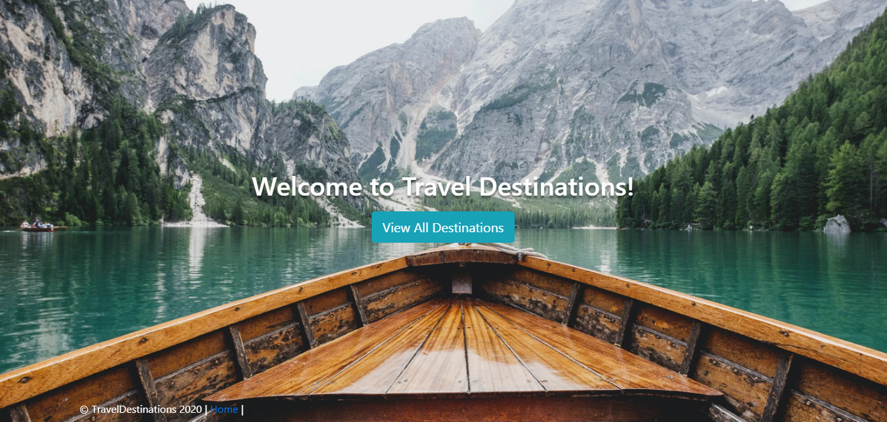
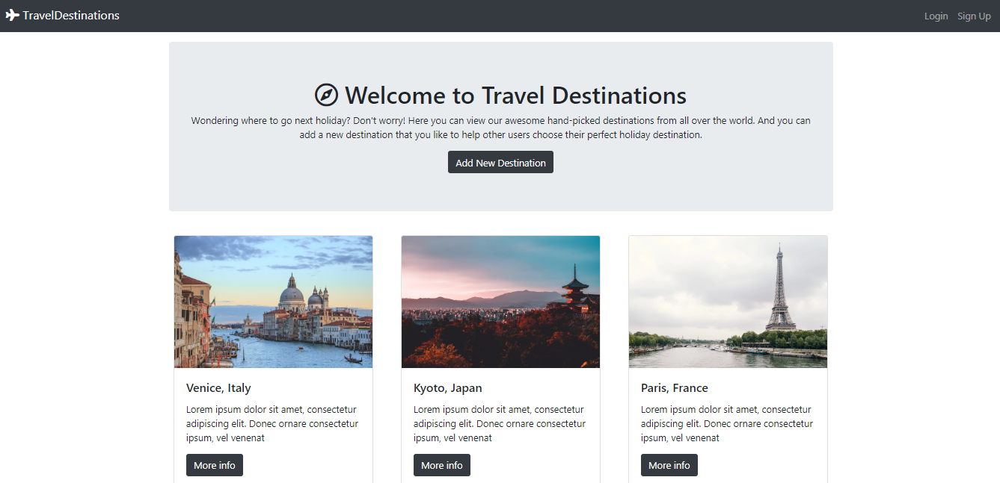

# Travel Destinations

## Table of contents

- [Introduction](#Introduction)
- [Demo](#demo)
- [Features](#features)
- [Technology](#technology)
- [Run](#run)
- [Sources](#sources)
- [License](#license)

## Introduction

A responsive web application that allows users to add their favorite travel destinations and discover places added by others.

## Demo





This application is deployed on Render (Originally it was on Heroku). It can be accessed through the following link but might take a while to load due to using the free plan:

[Travel Destinations on Render](https://travel-destinations-ex7k.onrender.com/)

## Technology

The application is built with:

- Node.js version: 10.16.3
- MongoDB version: 4.2.0
- Express version: 4.17.1
- Bootstrap version: 4.4.1
- FontAwesome version: 5.13.0
- Mapquest API: used for geocoding
- Mapbox API: used to show the maps

## Features

The application allows users to do the following things:

- Create an account, login or logout
- Browse available destinations added by other users
- Check their location on map
- Add, modify, or delete their comments
- Add, modify, or delete their destinations
- A user must be logged in to add a comment or a destination

## Run

To run this application locally, follow these steps:

1. Install dependencies:

   ```bash
   npm install
   ```

2. Create a `.env` file in the root directory and set the following environment variables:

   ```
   DATABASEURL: this is the connection string of your MongoDB Atlas database.
   GEOCODER_PROVIDER: the name of the geocoder API that is used to geocode the longitude and latitude entered by users when they create a new destination.
   GEOCODER_API_KEY: the key that you will get when you set up an account for any API that you will use for geocoding.
   ```

3. (Optional) Seed the database with sample destinations:

   ```bash
   npm run seed
   ```

   This will create a sample user (username: "admin", password: "admin123") and add some initial destinations.

4. Start the application:

   ```bash
   npm start
   ```

5. Open your browser and navigate to `http://localhost:3000`

## Sources

This application was created after finishing [The Web Developer Bootcamp](https://www.udemy.com/course/the-web-developer-bootcamp/) course on Udemy by Colt Steele. In the course, an application called YelpCamp was created, which is similar to this one. The main difference is that YelpCamp used Google maps to show the maps, while TravelDestinations uses Mapquest and Mapbox. The idea of the website is also a bit different.

## License

[](http://badges.mit-license.org)

- MIT License
- Copyright 2020 © [Maryam Aljanabi](https://github.com/maryamaljanabi)
